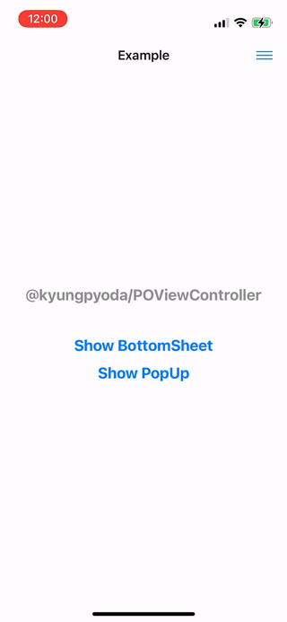

# POViewController
**Pio's Awesome Customizable ViewController**

`POViewController` is a is a subclass of `UIViewController`, and it's easy to customize view size and presentation position.

## Usage

<table>
<tr>
<td>Style</td> <td> Code </td> <td> Image </td>
</tr>
<tr>
<td>
Pop Up
</td>
<td>

```swift
class PopUpViewController: POViewController {
    ...
    init() {
        super.init(
            direction: .center,
            viewSize: .init(
                width: .absolute(200),
                height: .fit
            ),
            isSwipeEnabled: false
        )
    }
    ...
}
```

</td>
<td>



</td>
</tr>
<tr>
<td>
Bottom Sheet
</td>
<td>

```swift
class BottomSheetViewController: POViewController {
    ...
    init() {
        super.init(
            direction: .bottom,
            viewSize: .init(
                width: .full,
                height: .absolute(300)
            ),
            isSwipeEnabled: true
        )
    }
    ...
}
```

</td>
<td>


</td>
</tr>
<tr>
<td>
Side Menu
</td>
<td>

```swift
class SideMenuViewController: POViewController {
    ...
    init() {
        super.init(
            direction: .right,
            viewSize: .init(
                width: .fit,
                height: .full
            ),
            isSwipeEnabled: true
        )
    }
    ...
}
```

</td>
<td>


</td>
</tr>
</table>

Please refer to the example project.

To run the example project, clone this repository, open `Example.xcodeproj` in the Example folder.  

## Requirements
- iOS 13.0+
- `POViewController` is written in Swift 5.5

## Installation

### Swift Package Manager (SPM)
To install `POViewController` using Swift Package Manager(SPM), you can follow the [tutorial published by Apple](https://developer.apple.com/documentation/swift_packages/adding_package_dependencies_to_your_app).
1. In Xcode, select "File" → "Add Packages"
2. Enter `https://github.com/kyungpyoda/POViewController.git` to add package dependency.

### CocoaPods
`pod 'POViewController'`

## Contributing
Contributions of any kind are welcome! 🤗

## License
 `POViewController` is available under the MIT License. See `LICENSE` for details.

